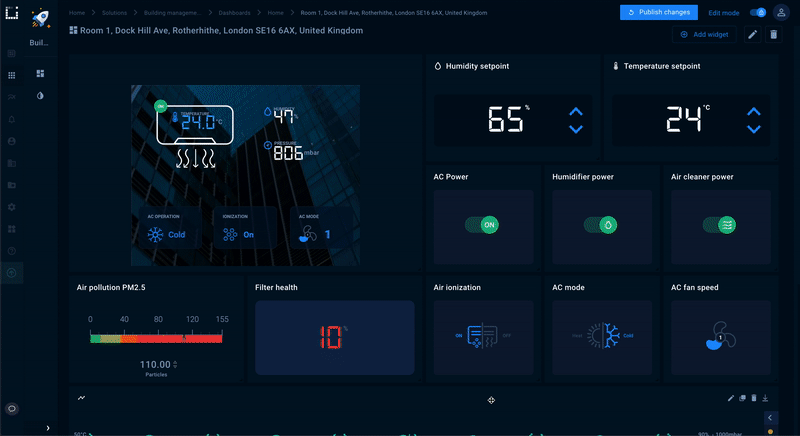

# Kaa Custom Configuration Widget 

This project contains the source code of the custom configuration widget for the [Custom widget tutorial](https://docs.kaaiot.io/KAA/docs/current/Tutorials/getting-started/custom-widget/) created for the [KaaIoT platform](https://www.kaaproject.org/).



Feel free to change any files and add new packages you want.

## Prerequisites

* Access to KaaIoT UI. You can [create a free cloud account](https://www.kaaproject.org/free-trial) if you don't have one.
* [Node.js](https://nodejs.org/en/) > 15 or [nvm](https://github.com/nvm-sh/nvm)
* npm

## Up and running

Clone this repo:

```sh
git clone https://github.com/kaaproject/kaa-widget-webpack.git
```

If you have nvm:

```sh
nvm install

# Next time for new terminal session
nvm use
```

Install dependencies:

```sh
npm i
```

Run development mode:

```sh
npm start
```

Login into any running KaaIoT [Web Dashboard](https://docs.kaaiot.io/KAA/docs/latest/Features/Visualization/WD/) UI and create a new widget from `Custom widgets` page.

To make a production build:

```sh
npm run build
```

Production build compiles to `dist/index.js`. You can upload this file into running KaaIoT platform using Web Dashboard UI